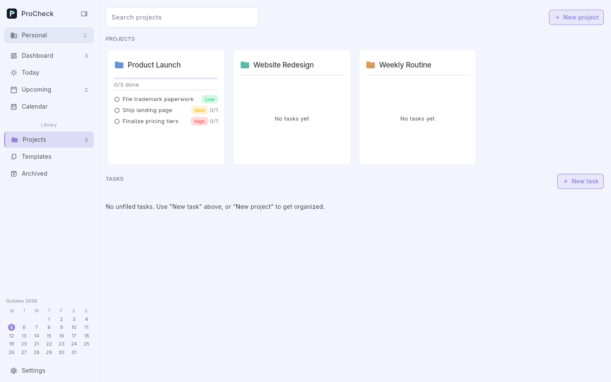
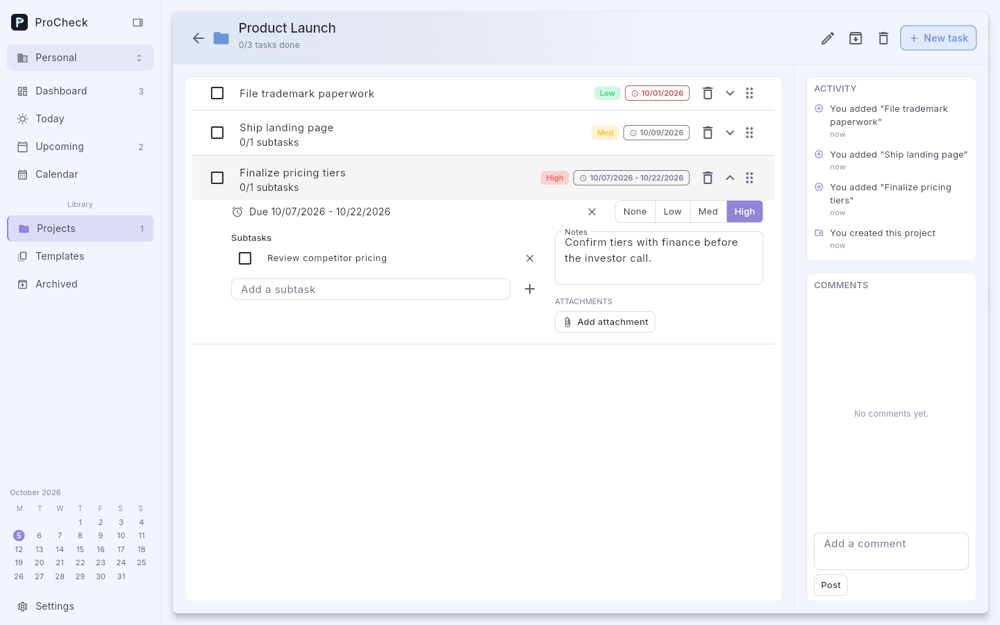
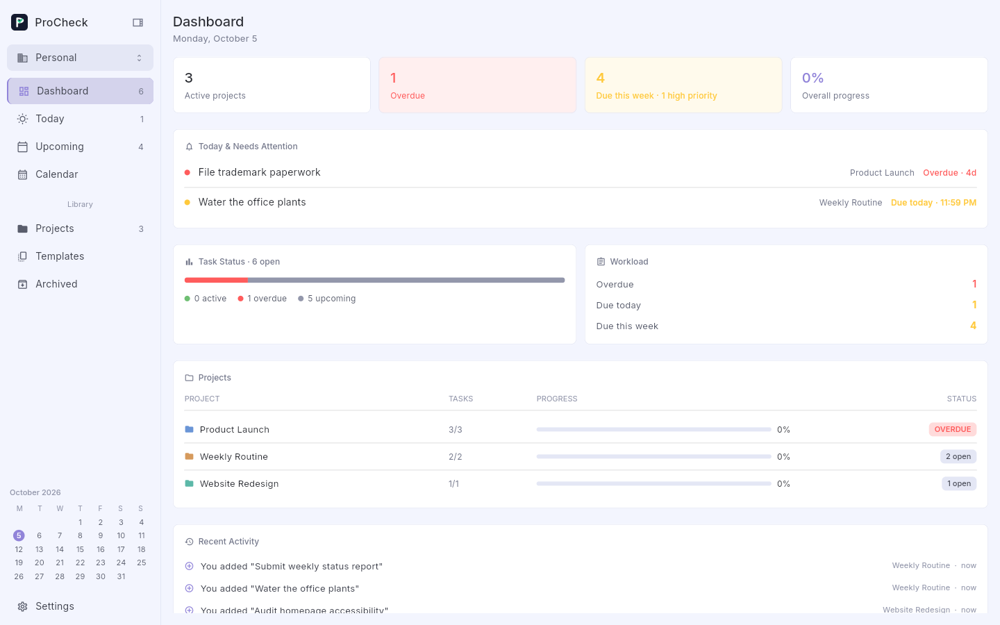
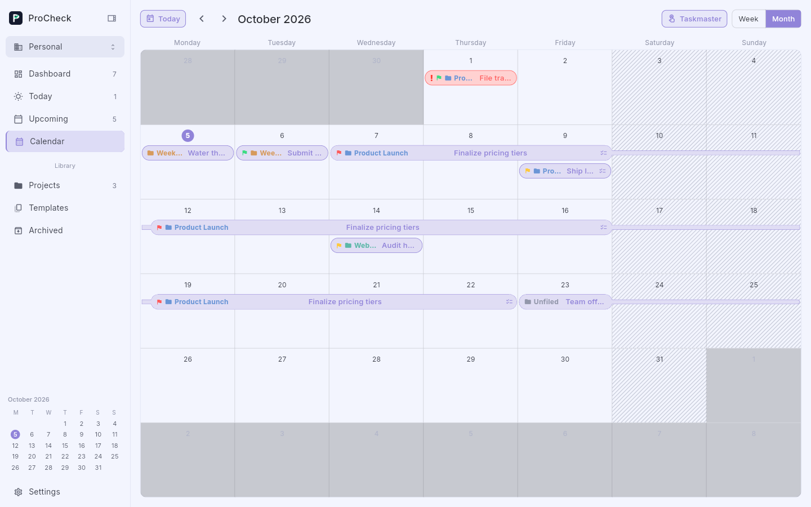
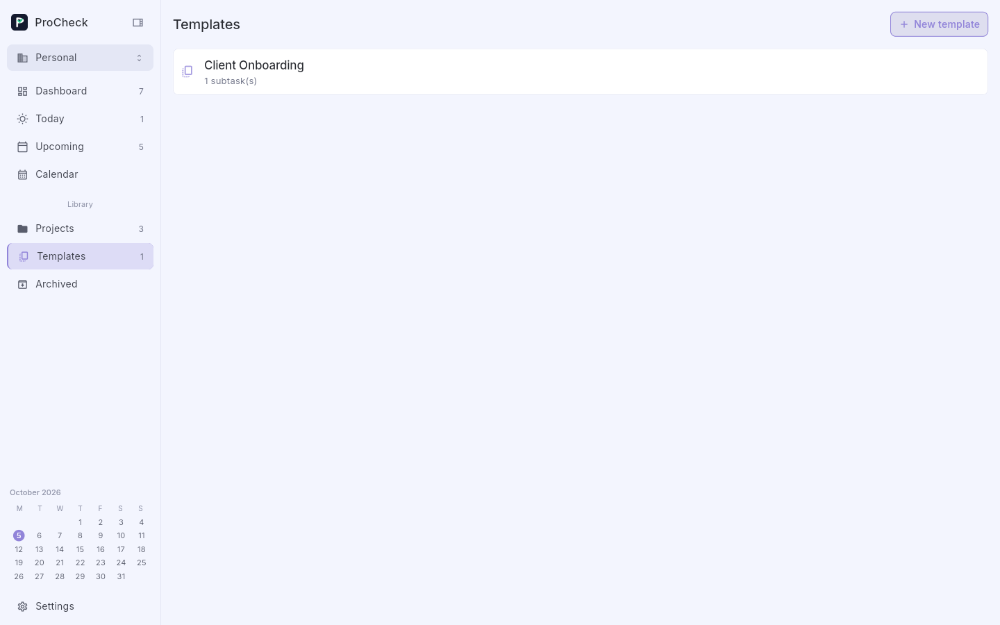
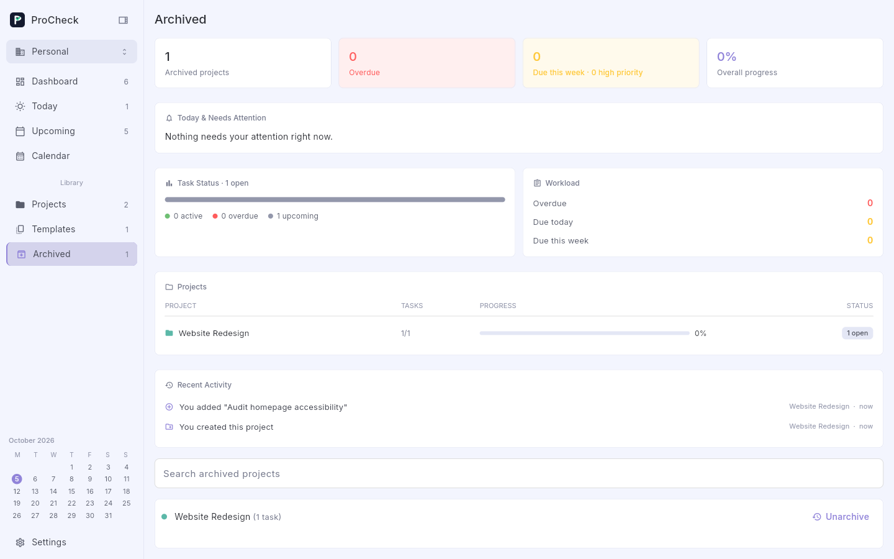
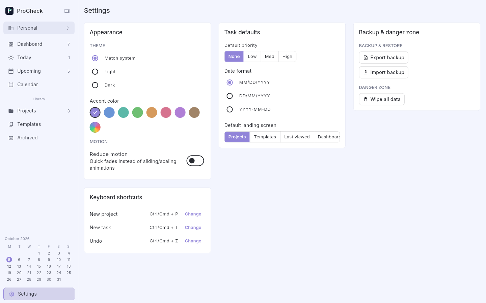
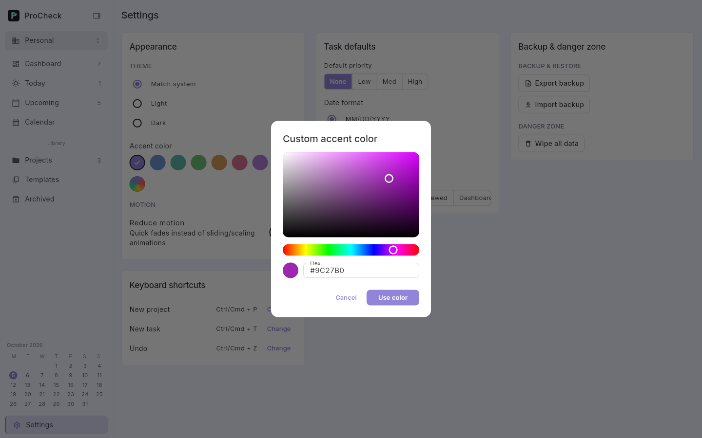

# ProCheck

ProCheck is a lightweight cross-platform task app built with Flutter. Organize work into projects, plan it on a full calendar, and reuse task templates whenever you need that same structure again.



## Features

### Projects, tasks & subtasks

Group related tasks into projects, each with its own accent color. A task can carry notes, a due date (or a due-date **range**, picked from one tap-driven calendar), a priority, file attachments, and a list of subtasks — checking off every subtask automatically checks the task, and toggling the task cascades back down. Opening a task expands it in place, showing its subtasks and notes beside it; opening another task in the same project automatically collapses the previous one (accordion-style). Checking off a task plays a short chime.



### Dashboard

A one-page overview of all your active projects: overdue/due-this-week counts and overall completion, a "Today & Needs Attention" list, a task-status breakdown, a sortable projects table, and a recent-activity feed.



### Calendar & Taskmaster

A full Week/Month calendar renders every task as a bar across its due date(s); multi-day tasks draw one continuous bar, and a task that runs from a weekday into the weekend tapers into a slim connector rather than disconnecting. Each day shows as many task pills as actually fit its row — the count adjusts live as you resize the window, with the rest collapsing into a "+N more" chip. Flip on **Taskmaster** to create tasks directly on the grid: click a day, or drag across days for a multi-day task, with a live ghost preview following your cursor.



### Smart views

**Today** and **Upcoming** list every open task due today or later, across all projects, in one flat list — no need to open each project to see what's due.

### Templates

Define a main task and its subtasks once as a template, then spin up new tasks from it whenever you need that same structure again.



### Archive

Archiving a project tucks it out of your active views without deleting it. The Archived screen is the same dashboard overview — stats, attention list, activity feed — scoped to just your archived projects, with a one-click Unarchive to bring one back.



### Settings

Theme (system/light/dark), a curated accent-color palette or a full saturation/hue picker with hex input, a "reduce motion" toggle, task defaults (priority, date format, default landing screen), rebindable keyboard shortcuts, and backup/restore (export or import your entire workspace as a `.json` file) plus a "Wipe all data" reset.





### Everything else

- **Multi-step undo** — every project or task deletion goes onto a real history stack, not just a single "last action"; `Ctrl/Cmd+Z` walks back through consecutive deletions, and a floating Undo toast offers the most recent one.
- **Workspaces** — switch between separate sets of projects/tasks/templates from the sidebar, with a pinned Favorites section and a mini calendar for quick date jumps.
- **Notifications** — local reminders tied to each task's due date/time (Android, iOS, macOS, Linux, Windows).
- Works on Android, iOS, web, and Windows/Linux/macOS desktop from a single codebase. Data is stored locally on-device (via [Hive](https://pub.dev/packages/hive)), no account or server required. On Windows, data lives under `%LocalAppData%\ProCheck` (older installs that had data in Documents are migrated automatically on first launch).

## Getting started

Requires the [Flutter SDK](https://docs.flutter.dev/get-started/install) (stable channel).

```sh
flutter pub get
dart run build_runner build --delete-conflicting-outputs  # generates Hive model adapters
flutter run                                                # or: flutter run -d chrome / -d windows / -d linux
```

Run the tests with:

```sh
flutter analyze
flutter test
```

## Project structure

```
lib/
  models/      Hive data models (Project, Task, Subtask, TaskTemplate, TemplateSubtask)
  data/        Hive setup, backup/restore, notifications, progress history, sound effects
  providers/   Riverpod state notifiers (persist to Hive in the background)
  screens/     Dashboard, Today/Upcoming, Calendar, Day, Projects, project detail,
               templates, archived, settings, splash
  widgets/     Shared UI pieces (sidebar, app logo, project card, task tile, task
               detail editor, create-task sheet, color picker, page transitions,
               pop-out removal animation, wobble checkbox)
```

State management uses [Riverpod](https://riverpod.dev/); local persistence uses [Hive](https://pub.dev/packages/hive). Notifier methods update in-memory state synchronously and persist to disk in the background, so the UI never blocks on I/O.

Two reusable animation widgets back most of the app's motion: `WobbleCheckbox` (a quick squash-and-tilt bounce on toggle, shared by task and subtask checkboxes) and `PopOutRemoval` (a shrink-and-pop-out effect for deleted projects and tasks, whose layout footprint shrinks in real time so siblings resettle smoothly instead of jumping). Both respect the "reduce motion" setting.

## Windows builds

Every push builds a Windows release via GitHub Actions (`.github/workflows/windows-build.yml`) and publishes it as a versioned GitHub Release (e.g. `ProCheck v1.0.6`, tagged `v1.0.6-build.<run-number>` for uniqueness). Grab the latest `.zip` from the repo's [Releases page](../../releases), unzip it, and run `procheck.exe` — no installer needed.
